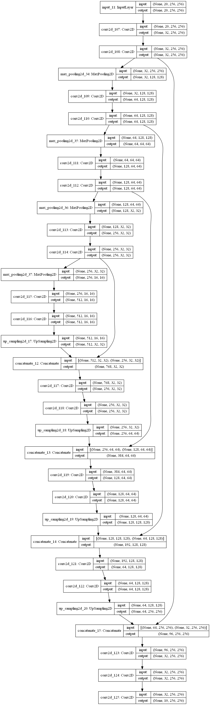

# Dstl-Satellite-Imagery-Features-Detection
Dstl provides you with 1km x 1km satellite images in both 3-band and 16-band formats. The goal is to detect and classify the types of objects found in these regions.

